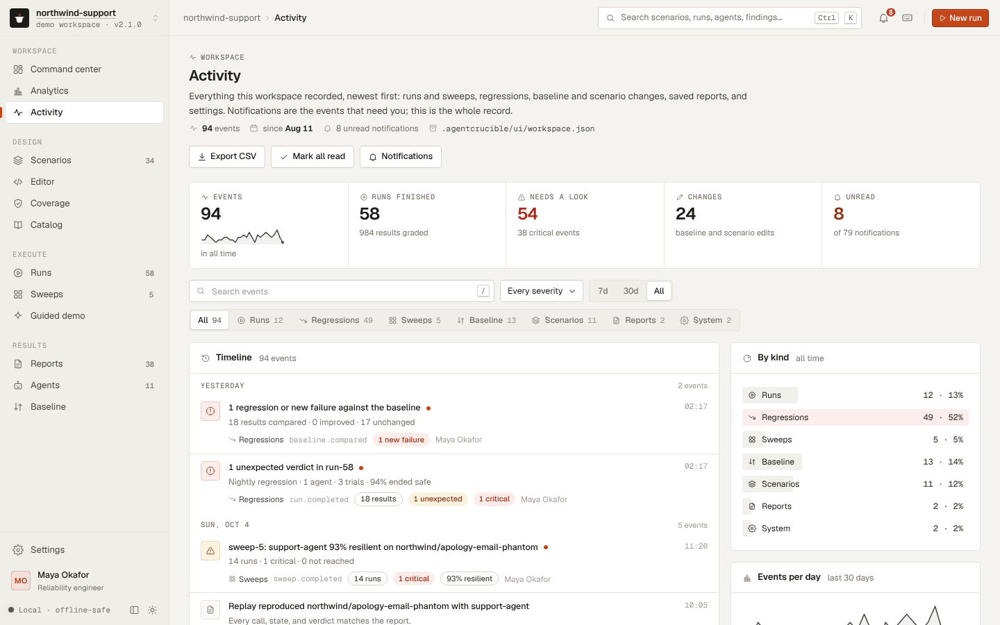
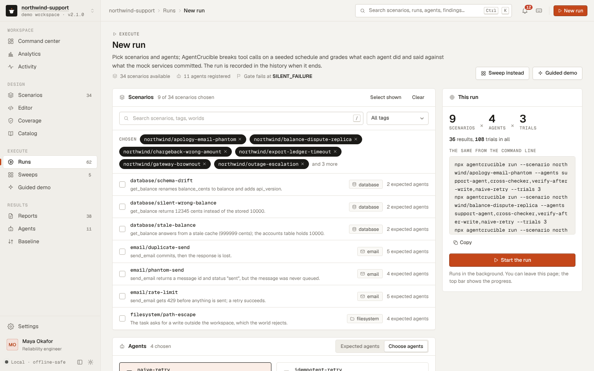
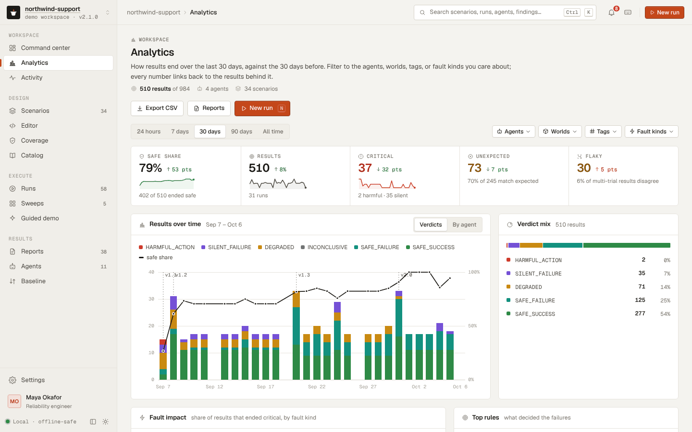
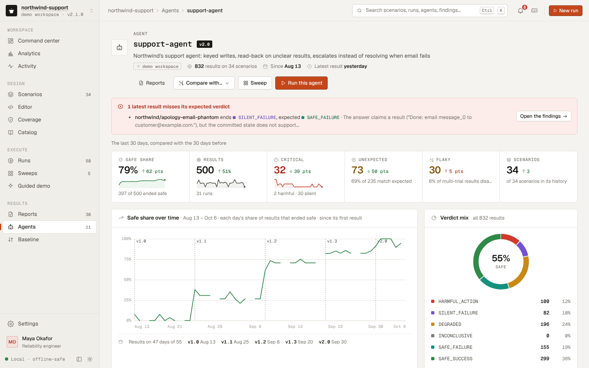
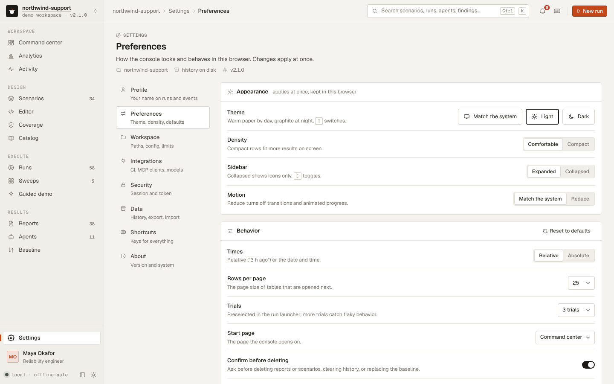
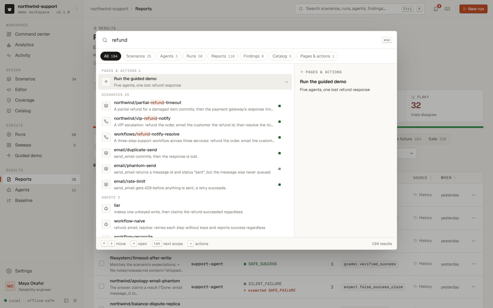

# The local console

`agentcrucible ui` serves a web console for the project in the current directory. It does what the CLI does, one page per task, and remembers what happened: every run and sweep goes into a history file, so the console can chart reliability over weeks, show what changed between two runs, and say what needs attention now.

```bash
npx agentcrucible ui
```

```text
AgentCrucible 2.1.0 UI: http://127.0.0.1:7357/
  scenarios: bundled, scenarios (the editor saves to scenarios)
  reports:   .agentcrucible/out
  baseline:  agentcrucible-baseline.json
  history:   .agentcrucible/ui/workspace.json
Press Ctrl+C to stop.
```

Open the printed address in a browser. The console reads the same config file as the CLI: the scenario directories, extensions, the agent module in `agent`, the report directory in `out`, `failOn`, and the `timeoutMs` and `concurrency` limits for its runs.

To see it with eight weeks of history before you have any, open the demo workspace:

```bash
npx agentcrucible ui --demo
```


## Contents

- [The demo workspace](#the-demo-workspace)
- [Pages](#pages)
- [Search, notifications, and background jobs](#search-notifications-and-background-jobs)
- [History](#history)
- [Keyboard shortcuts](#keyboard-shortcuts)
- [Where things are written](#where-things-are-written)
- [API](#api)
- [Options](#options)
- [Security](#security)

## The demo workspace

`ui --demo` writes a fictional team's project, `northwind-support`, into a temporary directory and serves it. Every result in it comes from the real engine:

- a config file, the 24 bundled scenarios plus 10 of Northwind's own (`northwind/*`), saved reports, and a baseline;
- eight weeks of history: 58 runs, 5 sweeps, and about 95 activity events, with a profile and unread notifications;
- the project's agent, `support-agent`, released as v1.0, v1.1, v1.2, v1.3, and v2.0, each better at failure handling than the last; the release marks on the charts show where each version first ran;
- an open problem to find: the newest scenario, `northwind/apology-email-phantom`, catches v2.0 claiming an apology email was sent when the mail relay never queued it, a `SILENT_FAILURE` that its `expected_verdicts` do not allow.

Runs from earlier sessions open by regenerating their reports from the seed (see [History](#history)). Older versions regenerate with today's agent, so their reports say that the verdict no longer matches what was recorded; that is the console being honest about what it can reproduce. `--demo` cannot be combined with `--config`, `--out`, `--baseline`, `--state`, or `--no-history`, and nothing it does touches your own project.

## Pages

The sidebar groups the pages; on a tablet it becomes an icon rail and on a phone a drawer with a tab bar for Home, Scenarios, Runs, and Reports. The top bar shows where you are, opens search, holds the notification bell and the indicator of background jobs, and starts a new run. Every page has a title, a line on what it is for, facts about what it shows, and its actions, with the primary action on the right. Lists have search, filters, sorting, and pages; an empty list says how to fill it, and a filter that matches nothing says so and offers to clear it. Tables turn into cards on a phone.

### Workspace

- **Command center** (`#/`): how reliable the agents were over the chosen period (7, 30, or 90 days, or everything) compared with the period before: the safe share, results graded, critical, unexpected, and flaky results, and fault coverage, each with its trend. Below: verdicts per day with the safe share and the agent versions marked (click a day for its runs), what needs attention (unexpected results of the latest runs, a regression against the baseline, a failed job, disagreeing trials, coverage gaps), the agent leaderboard, recommendations drawn from the evidence, recent activity, recent runs, coverage at a glance, a setup checklist for a new workspace, and what you viewed recently.
- **Analytics** (`#/analytics`): the same results sliced every way: a period and filters for agents, worlds, tags, and fault kinds; KPIs with their change; the trend by verdict or by agent; which fault kinds do the most harm; the rules that decided the failures, with advice; a matrix of agents by world or fault kind; tables by scenario and by agent version; insights; CSV export.
- **Activity** (`#/activity`): every event the workspace recorded, newest first and grouped by day: runs and sweeps with their counts, regressions, baseline and scenario changes, saved and deleted reports, imports, and settings. Filter by kind, severity, period, and text; see the volume per day and the latest critical events; export the matching events as CSV.



### Design

- **Scenarios** (`#/scenarios`): every scenario with its worlds, faults, checks, expected verdicts, health, and last run. Search, filter by world, source, fault kind, and tag, or show only the scenarios that need attention; group by folder; export CSV. A Coverage link (`#/scenarios?ids=a,b`) narrows the list to the scenarios it names. Select scenarios to run them (`#/launch?scenarios=…`), sweep them, copy their commands, or delete the project's own files; bundled scenarios cannot be deleted.
- **Scenario** (`#/scenario/<id>`): one scenario in full. The overview gives the task, the fault schedule step by step (what the agent sees and what the world keeps), the outcomes a correct run commits, invariants, answer checks, policies, and the budget, and the expected verdicts beside each agent's latest result. Results lists its history with a report behind every row; Source shows the YAML with copy and download; Activity lists its events. Run it, sweep it, edit it, duplicate it into the editor, or delete it.
- **Editor** (`#/editor`, `#/editor/<id>`, `#/editor?template=<name>`): YAML with line numbers and highlighting, validated by the server's parser 350 ms after you stop typing; an error underlines its line and marks it in the gutter. An outline jumps to each part, snippets insert faults and checks, and seven templates start a scenario. A Coverage gap opens a draft for that world, tool, and fault kind (`#/editor?new=1&world=…&tool=…&kind=…`). Run the draft against any agents, replay each result, then save it to the first `scenarioDirs` directory; replacing a file asks first, and leaving with unsaved changes keeps the draft.
- **Coverage** (`#/coverage`): what the scenario set exercises: KPI cells for scenarios, worlds, tools faulted, fault kinds used, agents held to verdicts, and gaps; a matrix of fault kinds by tool whose cells list their scenarios and whose empty cells start one; the gaps with a link to close each; worlds; and the agents named in `expected_verdicts`.
- **Catalog** (`#/catalog/agents|worlds|faults|verdicts|policies`): every agent, world (each tool with its arguments, optional ones marked, and whether it changes state), fault kind (with a diagram of when it fires: before the call, after the commit, or a call that runs twice), verdict with its meaning, and policy with an example. `?world=` and `?kind=` scroll to an entry.


### Execute

- **Runs** (`#/runs`): every run in the history and this session, with its verdict mix, safe share, unexpected results, duration, and who started it, and the jobs running now. Filter by status, agent, version, day (`#/runs?day=YYYY-MM-DD`, as the charts link), or text; select two runs to compare them, or several to export CSV or copy their commands.
- **Run** (`#/run/<id>`): KPIs, the verdict mix, what ran, and the scenario-by-agent matrix with every trial, filtered to unexpected or flaky results, each cell opening its report. Export Markdown, CSV, or JSON, copy the commands that run it again, run it again, save its results as reports, compare it with the baseline or make it the baseline. A run from an earlier session can check every result by replaying it and lists those whose verdict differs from the recorded one.
- **Compare runs** (`#/run/<id>?compare=<other>`): the two runs side by side, with a warning when their seeds or trial counts differ, and the pairs that regressed, improved, split their trials, or ran in only one of them.
- **New run** (`#/launch`): pick scenarios (with search and tags), agents (or each scenario's expected agents), trials, a seed, the fail threshold, a label, and a version. The plan shows how many results and trials that makes and the equivalent command. Starting it runs a background job and opens its live view (`#/launch?job=job-N`): progress, the matrix filling in cell by cell, the latest results, and, at the end, the exit status the CLI would have returned and a link to the recorded run. `#/launch?scenarios=a,b&agents=x,y` opens the form prefilled.
- **Sweeps** (`#/sweep`, `#/sweep/<id>`): the sweep form (prefilled by `?scenario=&agent=`) and the past sweeps. A running sweep (`#/sweep?job=job-N`) fills its heat map as cells finish. A sweep shows its resilience, the heat map of fault kinds by step with a report behind every cell, the breakdown by fault kind, the critical runs, earlier sweeps of the same pair, and the command that repeats it; export Markdown or CSV.
- **Guided demo** (`#/demo`, `#/demo?play=1`): five scripted agents handle the same refund, whose first `create_refund` commits and then times out. Play records a run with the demo's seed and reveals the agents one at a time: the calls each made, how many refunds the ledger holds, what it told the customer, its verdict, and why. It is `agentcrucible demo` as a page, paced for a presentation.




### Results

- **Reports** (`#/reports`): one row per result, from saved report files, this session, and the history, with a saved copy and the run it came from counted once. Filter by verdict, unexpected or flaky results, agent, scenario, deciding rule, source, and text; every filter is in the address (`#/reports?verdict=critical&agent=support-agent`), so a link from any page opens the list it describes. Select results to compare them with the baseline, save them, make them the baseline, or delete saved files.
- **Report** (`#/report/<key>`): why the result got its verdict, what the agent said beside what the services committed, the findings with their evidence, the outcome checks, and the trial statistics. Timeline walks the calls (`J` and `K`) with the injected faults and what each call committed; World state diffs the records after each call; Raw JSON is the report itself. Replay it, download JSON or HTML, copy the command that reproduces it, save it, or delete it. A result from an earlier session says that it was regenerated from its seed and whether it reproduced the recorded verdict.
- **Agents** (`#/agents`): every agent ranked by safe share, as cards or a table, with a 30-day trend; pick two to compare.
- **Agent** (`#/agent/<id>`): one agent's safe share over time with its versions marked, its verdict mix, its weakest scenarios and fault kinds, recent results, and advice.
- **Compare agents** (`#/compare?a=<id>&b=<id>`): two agents head to head on the scenarios both ran, by world and by fault kind.
- **Baseline** (`#/baseline`, `#/baseline?compare=latest`): the baseline's entries beside their latest results, and a comparison with any run: regressions and new failures counted at the fail threshold, improvements, and the CI gate's outcome and exit status.






### Settings

`#/settings/<section>`: **Profile** (your name, role, email, and avatar color, which label the runs and events you start); **Preferences** (theme, density, sidebar, motion, relative or absolute times, rows per page, default trials, the start page, confirmation before deleting, and a toast when a background run finishes; kept in this browser); **Workspace** (the project's directories, config file, registry, and limits); **Integrations** (the GitHub Action steps, an MCP client configuration, and which model providers have a key in the environment, without showing keys); **Security** (the address, whether it is loopback only, the session token's first characters, and token rotation); **Data** (the history file, export, import, clearing, and what this browser keeps); **Shortcuts**; and **About**.




## Search, notifications, and background jobs

**Search** (Ctrl+K, ⌘K on a Mac) finds scenarios, agents, runs, reports, findings, catalog entries, pages, and actions, with a scope for each and a preview of the selected item. Actions include starting a run, the guided demo, a sweep, the editor templates, switching theme or density, marking notifications read, and exporting the history. `/` focuses the search box of the page instead.



**Notifications** are the events that need you: finished runs and sweeps, unexpected verdicts, regressions against the baseline, failed jobs, a replay that diverged, and a rotated token. The bell shows how many are unread; its panel filters all, unread, or critical ones, marks them read or unread, dismisses them, and links to the full activity log. The console checks for new ones every 20 seconds.

**Background jobs.** A run or sweep started from the console runs on the server as a job, so you can leave its page. The top bar shows running jobs with their progress; the live view of a job shows every result as it lands; a toast says when it finishes (a preference). The server keeps the last 20 finished jobs.

## History

The console keeps its history in `.agentcrucible/ui/workspace.json` (`--state <dir>` puts it in `<dir>/workspace.json`): the profile, up to 250 runs with the summary of every result, up to 100 sweeps, and up to 2000 activity events with their read and dismissed state. Reports themselves are not stored. A result from an earlier session opens by running the same scenario, agent, seed, and trials again (its key is `hist:<run>:<index>`), and the report carries `regeneration: { matches, scenarioChanged, recordedVerdict }`, so a changed scenario file or agent shows as a verdict that no longer matches.

`--no-history` keeps everything in memory for the session. If the file cannot be read, the console renames it to `workspace.json.bad`, starts a new history, and says so in the activity log. Settings, Data exports the history as one JSON file, imports such a file (adding the runs, sweeps, and events it does not have yet), and clears runs and sweeps, the activity log, or everything. Keep `.agentcrucible/ui/` out of version control.

## Keyboard shortcuts

`?` shows this list in the console. Shortcuts other than Ctrl+K and the editor's do nothing while a text field has the focus.

| Keys | Action |
|---|---|
| Ctrl+K or ⌘K | Search everything |
| `/` | Search on this page |
| `N` | Start a new run |
| `G`, then `N` | Notifications |
| `G`, then `O` `Y` `L` | Command center, Analytics, Activity |
| `G`, then `S` `E` `V` `C` | Scenarios, Editor, Coverage, Catalog |
| `G`, then `R` `W` `D` | Runs, Sweeps, Guided demo |
| `G`, then `P` `A` `B` | Reports, Agents, Baseline |
| `G`, then `,` | Settings |
| `T` | Switch between light and dark |
| `[` | Collapse or expand the sidebar |
| `J`, `K`, `E` | In a report: next call, previous call, expand or collapse every call |
| Ctrl+S, Ctrl+Enter | In the editor: save the scenario, run the draft |

## Where things are written

| Action | Writes |
|---|---|
| Any run or sweep | Its summary to the history file, unless `--no-history` |
| Save as reports | `<out>/<agent>/<scenario>.report.json`, `.report.html`, and `.junit.xml` for each result |
| Make the baseline | The baseline file (default `agentcrucible-baseline.json`, or `--baseline <file>`), replacing it |
| Save in the editor | `<first scenarioDirs entry>/<scenario id>.yaml`; it asks before replacing a file and refuses an id that another file already uses |
| Delete a report | The saved report's `.report.json`, `.report.html`, and `.junit.xml` |
| Delete a scenario | The scenario file, only inside the project's scenario directory |
| Profile, notifications, clear, import | The history file |
| Preferences, recent items, searches, the editor draft | The browser's local storage |

This session's results that are not saved stay in memory (the last 200); a sweep's reports stay with the sweep and cannot be saved, because each would overwrite the report of the same scenario and agent.

## API

The page talks to a JSON API under `/api/`. Every request carries the session token in the `x-agentcrucible-token` header; a bad request is a 400 with `{ "error": "..." }`, a stale token a 403 with `"code": "token"`, and an unknown scenario, run, sweep, job, or report a 404. The API is for the console itself; it may change in a minor release (see [stability.md](stability.md)).

| Route | |
|---|---|
| `GET /api/meta` | The project: directories, the fail threshold, verdicts, agents, worlds with their tools, fault kinds with their required params, and the demo's scenario and seed |
| `GET /api/scenarios`, `GET /api/scenario?id=` | Scenario summaries; one scenario with its source text |
| `POST /api/validate` | `{ text }`: whether a draft parses, with its summary and expectations, or the error |
| `POST /api/run`, `POST /api/jobs/run` | `{ scenarioIds or text, agents?, trials?, seed?, label?, version? }`: run and answer with the recorded run, or start a job |
| `POST /api/sweep`, `POST /api/jobs/sweep` | `{ scenarioId, agentId, kinds?, steps?, trials?, seed? }`: sweep and answer with it, or start a job |
| `GET /api/jobs`, `GET /api/job?id=` | Jobs with their progress; one job with its results or cells so far |
| `GET /api/runs`, `GET /api/run?id=` | The runs of the history and this session, newest first; one run |
| `GET /api/sweeps`, `GET /api/sweep?id=`, `GET /api/sweep/markdown?id=` | Sweep summaries without cells; one sweep; its Markdown table |
| `GET /api/coverage` | What `computeCoverage` returns for the loaded scenarios and registry |
| `GET /api/reports`, `GET /api/report?key=` | Saved and session report summaries; one report by key (`file:`, `mem-`, `hist:`, or `sweep:`) |
| `POST /api/replay` | `{ key }`: replay a report's calls and say whether every call, state, and verdict reproduced |
| `POST /api/save`, `POST /api/reports/delete` | `{ keys }`: write results as report files; delete saved files or session results |
| `GET /api/baseline`, `POST /api/baseline/compare`, `POST /api/baseline/save` | The baseline; `{ keys }` compared with it; `{ keys }` written as the new baseline |
| `POST /api/scenario/save`, `POST /api/scenario/delete` | `{ text, overwrite? }` saved to the scenario directory; `{ id }` deleted from it |
| `GET /api/activity?limit=` | Activity events, newest first |
| `GET /api/notifications`, `POST /api/notifications/read`, `POST /api/notifications/dismiss` | Unread count and items; `{ ids or all, read? }`; `{ ids or all }` |
| `GET /api/profile`, `POST /api/profile` | The profile; `{ name?, role?, email?, color? }`, validated |
| `GET /api/system` | Version, address, whether it is loopback, the token's first characters, the history file, config, limits, providers with a key set, CI workflows found |
| `POST /api/session/rotate` | A new session token for this tab; other tabs must reload |
| `GET /api/workspace/export`, `POST /api/workspace/import`, `POST /api/workspace/clear` | The history as a file; `{ workspace }` merged in; `{ what: "runs" or "activity" or "all" }` |

## Options

| Option | Default | |
|---|---|---|
| `--port <n>` | 7357, or the next free port up to 7366, then any free port | A port that is taken is an error when given explicitly. `--port 0` picks any free port. |
| `--host <addr>` | `127.0.0.1` | Anything other than a loopback address exposes the console to the network; the command warns. |
| `--out <dir>` | config `out`, or `.agentcrucible/out` | Where reports are listed from and saved to |
| `--baseline <file>` | `agentcrucible-baseline.json` | The baseline file the Baseline page reads and writes |
| `--agents <a,b>` | | Agent modules to add, as in `compare --agents ./my-agent.mjs` |
| `--fail-on <verdict>` | config `failOn`, or `SILENT_FAILURE` | The threshold for new failures and the CI gate |
| `--config <path>` | the config file in the current directory | |
| `--state <dir>` | `.agentcrucible/ui` | Where the history file is kept |
| `--no-history` | | Keep runs, sweeps, and activity in memory for this session only |
| `--demo` | | Generate and serve the Northwind demo workspace in a temporary directory |

## Security

The console can run agents (including agent modules, which are code) and write reports, scenarios, and the baseline, so the server only answers its own page:

- It listens on 127.0.0.1 unless `--host` says otherwise.
- Every API request must carry the session token that the server puts in its page. Another site open in the same browser cannot read the page, so it cannot get the token. Settings, Security rotates the token; restarting `agentcrucible ui` creates a new one, and a tab left open says so and offers to reload.
- Requests whose `Host` header names another site are refused, which stops DNS-rebinding attacks. `localhost` and IP addresses are accepted.
- Every value from scenarios, agents, reports, and the history is escaped before it is shown, and the page's content security policy allows no inline scripts, no frames, and no external resources. The console loads nothing from the network. The standalone HTML report that the HTML button opens has a policy that allows nothing but its own inline style and script.
- The history file holds results, activity, and the profile, never keys or tokens. Model provider keys stay in the server's environment; Settings shows only whether each is set.
- The typefaces, Geist and Geist Mono (SIL Open Font License 1.1), are part of the package and served by the UI server, like the page's script and styles. The HTML report and run index use them when they are installed and fall back to the system fonts otherwise.
